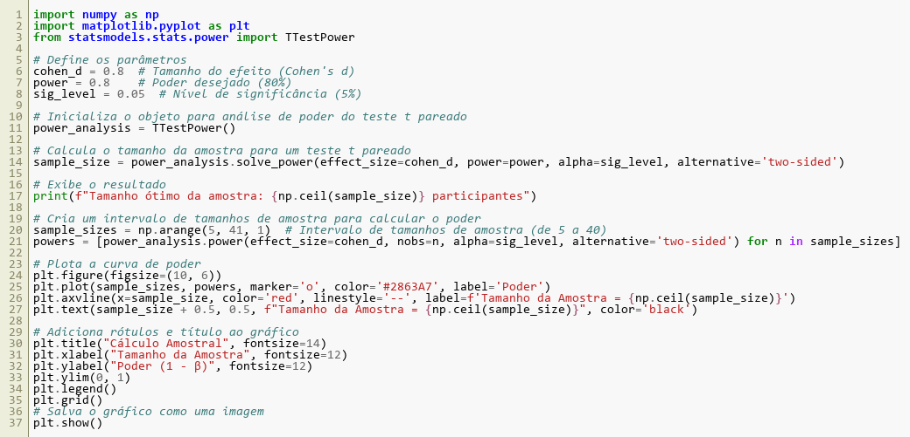

## 1. Cálculo amostral
O presente estudo considera que exercícios de força de média intensidade (ex., 70% de 1RM) são afetados pela fadiga mental (Lima-Junio et al., 2024; Queiros et al., 2021), resultando em uma maior percepção subjetiva de esforço quando comparado a condição controle e levando o indivíduo a interromper a tarefa (Lima-Junio et al., 2024; Queiros et al., 2021). Deste modo, foi utilizada a biblioteca “statsmodels” no Python, para determinar o tamanho da amostra do presente estudo. Especificamente, o cálculo do tamanho amostral foi baseado em um tamanho de efeito grande (Cohen’s d = 0,80), conforme estudos prévios que investigaram fadiga mental no treinamento de força (de Lima-Junior et al., 2024; Queiros et al., 2021). Foi utilizado a função “solve_power” da classe “TTestPower” com os seguintes parâmetros: tamanho de efeito (Cohen’s d = 0,80), nível de significância (alpha = 0,05) e poder estatístico (power = 0,80). O código completo encontra-se na .

 
Os resultados indicaram que o tamanho de amostra necessário seria de 15 sujeitos (Figura 2). Considerando uma possível perda amostral, optamos por coletar dados de 20 participantes, de forma a garantir o poder estatístico adequado mesmo em caso de perda amostral. Como o presente estudo investigará as diferenças individuais entre participantes com melhores e piores habilidades cognitivas, a amostra será dividida em dois grupos, sendo um composto por 20 indivíduos com altas habilidades cognitivas e outro por 20 indivíduos com baixas habilidades cognitivas. Além disso, serão incluídos 10 participantes classificados como mediano desempenho cognitivo. A inclusão desses 10 participantes intermediários terá como objetivo assegurar a separação adequada entre os grupos e reduzir o risco de sobreposição entre os grupos classificados como melhores e piores habilidades cognitivas. Essa estratégia permitirá que o critério de classificação seja validado e que os grupos representem com maior precisão as extremidades das habilidades cognitivas avaliadas.

.

## 2. Processo de Aleatorização das Condições e Procedimentos:
Cada sujeito participará de cinco visitas, sendo duas condições experimentais (controle e fadiga mental) distribuídos em uma ordem aleatória e balanceada. A ordem será mantida para ambas as sessões do mesmo participante, que não terá conhecimento prévio das condições. O código em Python que será utilizado para aleatorizar as sessões, está representado na Figura 3.

.
 
Nas duas primeiras sessões, os participantes realizarão a caracterização da amostra, na qual serão aplicados os seguintes testes cognitivos, na seguinte ordem: 1) Matrizes de Viena, 2) Span de Dígitos, 3) Fluência Verbal (Letra F e animais), no segundo dia os testes de 4) Teste dos Cinco Dígitos e 5) RAVLT. Já na terceira visita será realizada a familiarização com a tarefa de Stroop e o teste de 1RM do exercício de Meio Agachamento.
Na quarta e quinta sessões os voluntários serão alocados aleatoriamente nas condições 45 minutos de FM (através da tarefa de Flanker) ou 45 minutos de sessão controle (assistir documentário) em que o dispositivo de eletroencefalografia será posicionados nos participantes após eles estarem confortavelmente sentados. Antes e após as sessões experimentais os voluntários responderam a VAS para o estado mental e motivação e realizaram a tarefa de Stroop. Após dois minutos, executarão três séries máximas (i.e., até a falha muscular concêntrica) do exercício de Meio Agachamento a 70% de 1RM. Os participantes serão solicitados a relatar o PSE para essa tarefa imediatamente após cada série. As coletas de dados serão realizadas individualmente.
 
Figura 4: Procedimentos

## 2.Referências

ALLEN, D. G.; LAMB, G. D.; WESTERBLAD, H. Skeletal muscle fatigue: cellular mechanisms. Physiological Reviews, v. 88, n. 1, p. 287-332, 2008. Disponível em: https://doi.org/10.1152/physrev.00015.2007.
BOKSEM, M. A. S.; MEIJMAN, T. F.; LORIST, M. M. Effects of mental fatigue on attention: an ERP study. Cognitive Brain Research, v. 25, n. 1, p. 107-116, 2005. Disponível em: https://doi.org/10.1016/j.cogbrainres.2005.04.011.
BORG, G. A. V. Psychophysical bases of perceived exertion. Medicine & Science in Sports & Exercise, v. 14, n. 5, p. 377-381, 1982. Disponível em: https://journals.lww.com/acsm-msse/fulltext/1982/05000/psychophysical_bases_of_perceived_exertion.12.aspx.
BRAZAITIS, M.; SATAS, A. Regular short-duration breaks do not prevent mental fatigue and decline in cognitive efficiency in healthy young men during an office-like simulated mental working day: an EEG study. International Journal of Psychophysiology, v. 188, p. 33-46, 2023. Disponível em: https://doi.org/10.1016/j.ijpsycho.2023.03.007.
BROWN, L. E.; WEIR, J. P.; OLIVEIRA, H. B.; BOTTARO, M.; LIMA, L. C. J.; FERNANDES FILHO. Recomendação de procedimentos da Sociedade Americana de Fisiologia do Exercício (ASEP) I: avaliação precisa da força e potência muscular. Revista Brasileira de Ciência e Movimento, v. 11, n. 4, p. 95-110, 2003.
DIAMOND, A.; BARNETT, W. S.; THOMAS, J.; MUNRO, S. Preschool program improves cognitive control. Science, v. 318, n. 5855, p. 1387-1388, 30 nov. 2007.
ENOKA, R. M.; DUCHATEAU, J. Muscle fatigue: what, why and how it influences muscle function. The Journal of Physiology, v. 586, n. 1, p. 11-23, 2008. Disponível em: https://doi.org/10.1113/jphysiol.2007.139477.
FARO, H.; FRANCHINI, E.; CAVALCANTE-SILVA, D.; SILVA, R. D.; BARBOSA, B. T.; MACHADO, D.; FORTES, L. Do prolonged social media use or cognitive tasks impair neuroelectric and visuomotor performance in taekwondo athletes? A randomized and controlled trial. Psychology of Sport and Exercise, v. 76, p. 102768, 2025. Disponível em: https://doi.org/10.1016/j.psychsport.2024.102768.
FILIPAS, L.; FERIOLI, D.; BANFI, G.; LA TORRE, A.; VITALE, J. A. Single and combined effect of acute sleep restriction and mental fatigue on basketball free-throw performance. International Journal of Sports Physiology and Performance, v. 16, n. 3, p. 415-420, 2021. Disponível em: https://doi.org/10.1123/ijspp.2020-0142.
FORTES, L. S.; DE LIMA-JÚNIOR, D.; FONSECA, F. S.; ALBUQUERQUE, M. R.; FERREIRA, M. E. C. Effect of mental fatigue on mean propulsive velocity, countermovement jump, and 100-m and 200-m dash performance in male college sprinters. Applied Neuropsychology: Adult, v. 31, n. 3, p. 264-273, 2024. Disponível em: https://doi.org/10.1080/23279095.2021.2020791.
FRAGALA, M. S.; CADORE, E. L.; DORGO, S.; IZQUIERDO, M.; KRAEMER, W. J.; PETERSON, M. D.; RYAN, E. D. Resistance training for older adults: position statement from the National Strength and Conditioning Association. The Journal of Strength & Conditioning Research, v. 33, n. 8, p. 2019-2052, 2019. Disponível em: https://doi.org/10.1519/jsc.0000000000003230.
HOOPER, B.; FARIA, L. O.; FORTES, L. D. S.; WANNER, S. P. et al. Development and reliability of a test for assessing executive functions during exercise. Applied Neuropsychology: Adult, 2020. p. 1-11.
LIMA-JUNIOR, D.; GANTOIS, P.; NAKAMURA, F. Y.; MARCORA, S. M.; BATISTA, G. R.; BARTOLOMEI, S.; FERREIRA, M. E. C.; FORTES, L. Mental fatigue impairs the number of repetitions to muscular failure in the half back-squat exercise for low- and mid- but not high-intensity resistance exercise. European Journal of Sport Science, v. 24, n. 4, p. 395-404, 2024. Disponível em: https://doi.org/10.1002/ejsc.12029.
MALLOY-DINIZ, L. F.; FUENTES, D.; MATTOS, P. Avaliação neuropsicológica. 2. ed. Porto Alegre: Artmed, 2018. 
MARCORA, S. M.; STAIANO, W.; MANNING, V. Mental fatigue impairs physical performance in humans. Journal of Applied Physiology, v. 106, n. 3, p. 857-864, 2009. Disponível em: https://doi.org/10.1152/japplphysiol.91324.2008.
PICKERING, T.; WRIGHT, B.; MACMAHON, C. Fatigued or bored? Investigating the effect of different types of mental fatigue on 3 km running performance. Psychology of Sport and Exercise, v. 74, p. 102687, 2024. Disponível em: https://doi.org/10.1016/j.psychsport.2024.102687.
QUEIROS, V. S. D.; DANTAS, M.; FORTES, L. S.; SILVA, L. F.; SILVA, G. M.; DANTAS, P. M. S.; CABRAL, B. G. A. T. Mental fatigue reduces training volume in resistance exercise: a cross-over and randomized study. Perceptual and Motor Skills, v. 128, n. 1, p. 409-423, 2021. Disponível em: https://doi.org/10.1177/0031512520958935.
RATAMESS, N. A.; EVETOCH, T. K.; HOUSH, T. J.; KIBLER, W. B.; KRAEMER, W. J.; TRIPLETT, N. T. Progression models in resistance training for healthy adults. Medicine & Science in Sports & Exercise, v. 41, n. 3, p. 687-708, 2009. Disponível em: https://doi.org/10.1249/MSS.0b013e3181915670.
SMITH, M. R.; THOMPSON, C.; MARCORA, S. M.; SKORSKI, S.; MEYER, T.; COUTTS, A. J. Mental fatigue and soccer: current knowledge and future directions. Sports Medicine, v. 48, n. 7, p. 1525-1532, 2018. Disponível em: https://doi.org/10.1007/s40279-018-0908-2.
STROOP, J. R. Studies of interference in serial verbal reactions. Journal of Experimental Psychology, v. 18, n. 6, p. 643-662, 1935.
TRAN, Y.; CRAIG, A.; CRAIG, R.; CHAI, R.; NGUYEN, H. The influence of mental fatigue on brain activity: Evidence from a systematic review with meta-analyses. Psychophysiology, v. 57, n. 5, p. e13554, 2020. Disponível em: https://doi.org/10.1111/psyp.13554.
YAN, Y.; GUO, Y.; ZHOU, D. Mental fatigue causes significant activation of the prefrontal cortex: a systematic review and meta-analysis of fNIRS studies. Psychophysiology, v. 62, n. 1, p. e14747, 2025. Disponível em: https://doi.org/10.1111/psyp.14747.
